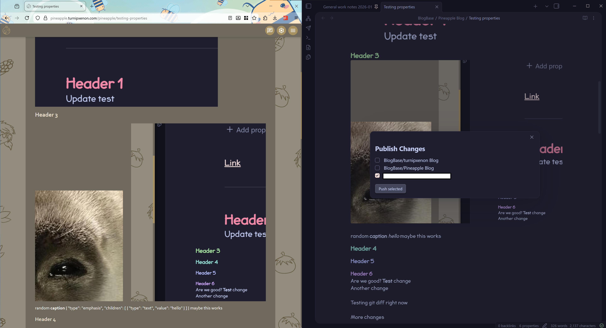

# Turnip's Blog Publisher Plugin

A fork of the [Obsidian Kanban Plugin](https://github.com/mgmeyers/obsidian-kanban) retrofitted as a personal blog publishing tool.

## What it does

Published markdown to a repo that my personal website parses. More details on that since I need to separate that project.



## Fork baseline

Changes relative to upstream Obsidian Kanban begin at commit `d8eaecacc3703a57c16b400d3bea6428b0dbfaee`.

## How to Find the Trigger ID

The trigger ID is **not** in the Cloudflare dashboard UI directly. The easiest way to find it is to manually trigger a build in the Cloudflare dashboard (Workers > your script > Deployments > Deploy) and watch the network request in DevTools. The request URL is:

```
POST https://dash.cloudflare.com/api/v4/accounts/{accountId}/builds/triggers/{triggerId}/builds
```
